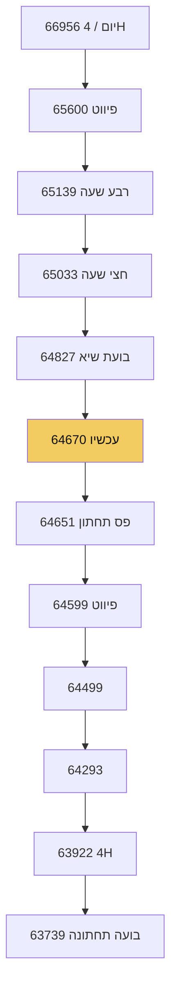
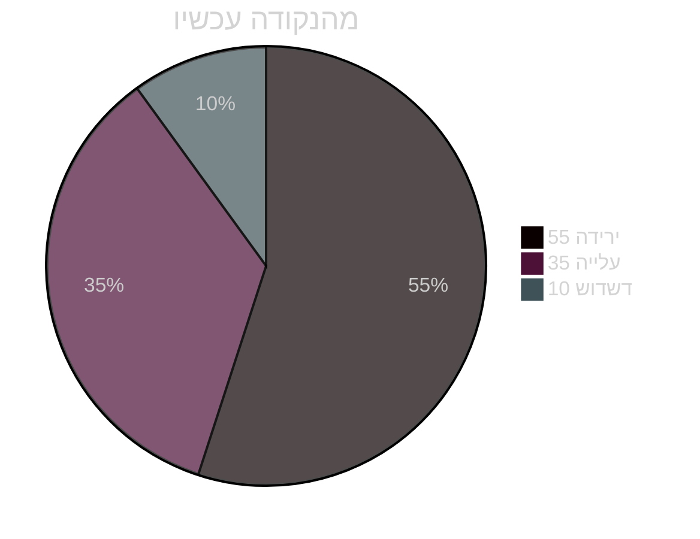
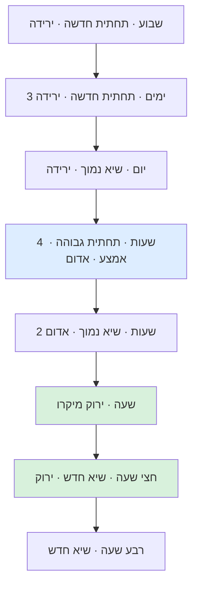
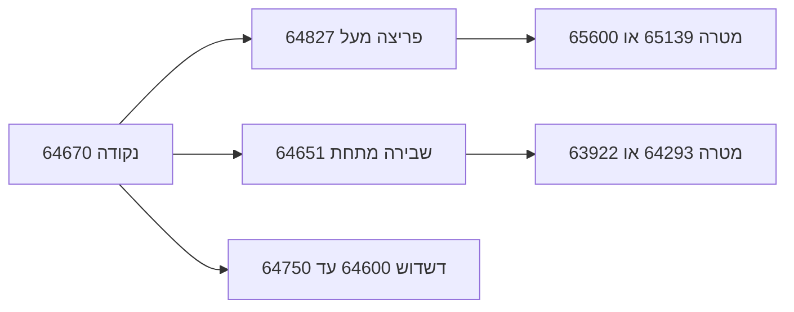

# תרשימים מניסוי 2

מקור:
[haiku-story-trial2.json](haiku-story-trial2.json)

מחיר עכשיו:
```
64670
```

## סולם מסלול



## הסתברות



## מגדל זמנים



## תרחישי כניסה



## הערת קול

הסיפור הבא צריך להיות בגוון אדם.
התרשימים האלה נגזרים מהמספרים.
לא מחליפים את הסיפור.
