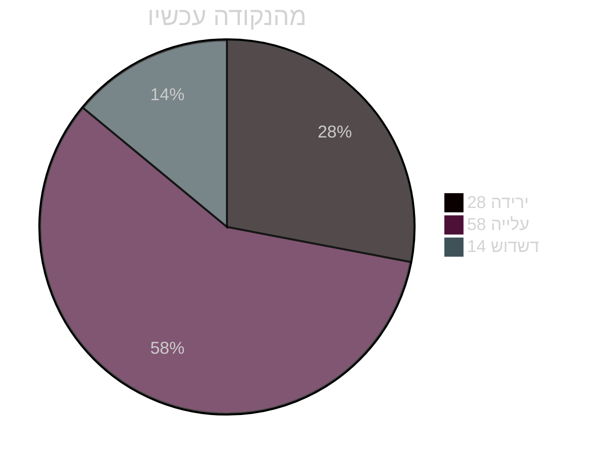
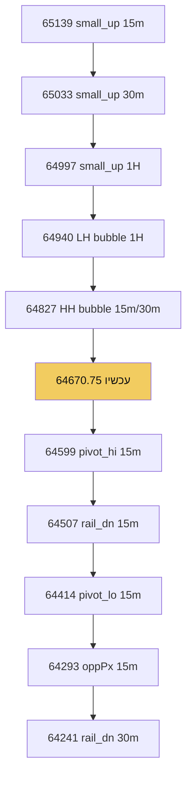
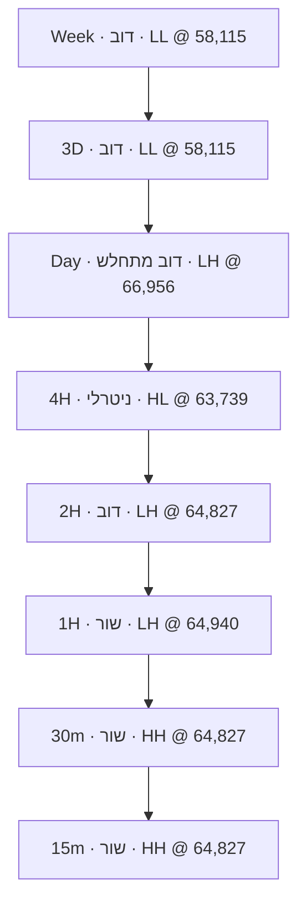
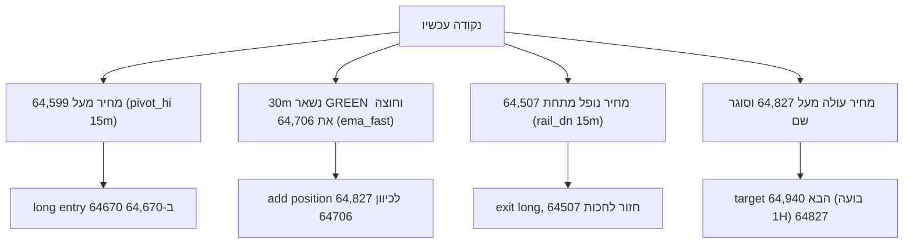

# סיפור ותרשימים · ניסוי 3

מחיר `64670.75`

## הסיפור

ביטקוין נמצא בתוך משחק דוב ארוך שמתחיל מ-Week. הגרף השבועי מראה LL (Low Lower) בבועה של 58,115 - זה אומר שהירידות הולכות ולהעמיק, והמגמה כלפי מטה חזקה. אבל יש כאן פרטים מעניינים: ה-EMA המהיר שלנו (69,998) עדיין מעל המחיר, וזה אומר שיש עדיין כוח קנייה בעומק. ב-3D אנחנו רואים את אותו LL בבועה, אבל הסטוכסטיק (r14) בערך 44 - זה אומר שאנחנו בתחתית של oversold, וזה מקום שבו בדרך כלל קונים מתחילים להתעניין. ה-Day מראה LH (Low Higher) בבועה של 66,956 - זה כבר סימן שהירידה מאטה, אבל עדיין בערוץ down. המחיר שלנו עכשיו 64,670.75 נמצא בין הרכבות (rails) של ה-4H, וזה אומר שאנחנו בעמדה ניטרלית למעשה. ה-2H מראה RED zap וערוץ down, אבל הסטוכסטיק (55) אומר שעדיין יש מקום ליותר ירידה. ה-1H הוא המפתח: יש לנו LH בבועה של 64,940 - זה אומר שהירידה מאטה בטווח הקצר, ו-mAbove = true אומר שהמחיר מעל הממוצע הנע. ה-30m מראה GREEN zap וערוץ up - זה הראשון שמראה כוח קנייה אמיתי. ה-15m מראה HH (High Higher) בבועה של 64,827 - זה אומר שהקונים שולטים בטווח הקצר מאוד. רכבת הדקה מראה סיפור מעניין: התחלנו עם HH עד 64,827, אחר כך היה flip ל-HL, ירידה עד 64,414, ואז flip חזרה ל-LH ב-64,459, ועכשיו אנחנו בחזרה ל-HH עם בועה של 64,827. זה אומר שהקונים חוזרים לשחק.

## פעימות

- Week ו-3D בLL - הדוב עמוק, אבל oversold בסטוכסטיק (44-39)
- Day מראה LH - הירידה מאטה, סימן ראשון של חוזק
- 4H ניטרלי בערוץ mid, אבל 2H עדיין בערוץ down עם RED
- 1H הוא הציר: LH בבועה עם mAbove=true, קונים חוזרים
- 30m ו-15m ירוקים - הקונים שולטים בטווח הקצר, HH בבועה של 64,827

## הסתברות

## סולם מסלול

## מגדל זמנים

## תרחישי כניסה

## חסר

['macdAngle - לא סופק לכל timeframes, לא יכול להשתמש בזה לאישור momentum']

